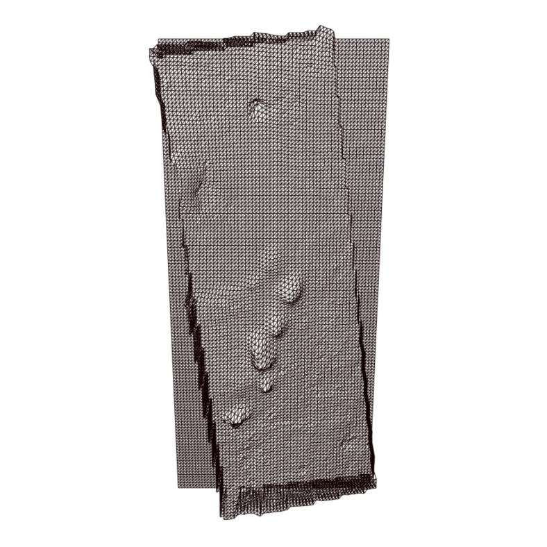

# automatic-hirise

<p align="center">
  
</p>

This repo contains two bash scrips and some HTML/JS useful for displaying [HIRISE digital terrain models (DTMs)](https://www.uahirise.org/dtm/) in the browser.

The goal is to automate away the [somewhat obscure knowledge](http://blog.mastermaps.com/2013/10/terrain-building-with-threejs-part-1.html) needed to:

- convert DTMs from .IMG to ENVI binaries with [gdal](https://www.gdal.org/)
- render the results with [three.js](https://threejs.org/)

If all the requirements are met, displaying terrain in 3D is as easy as dropping a DTM (e.g. hypanis.IMG) into the root directory and executing:

```bash
./scripts/convert.sh hypanis.IMG && ./scripts/serve.sh
```

### Demo

A pre-converted binary of [Hypanis Vallis](https://www.uahirise.org/dtm/dtm.php?ID=ESP_037651_1920) has been left in the docs directory (`./docs/hypanis.bin`).

To view it locally, execute:

```bash
./scripts/serve.sh
```

and visit [http://localhost:8000](http://localhost:8000).

## Requirements

- bash (tested on Ubuntu via Windows' WSL)
- gdal ([install instructions](https://stackoverflow.com/a/41613466/6591491))
- python3
- a web browser (tested on Chrome)

## Instructions

1. Download a [DTM from the Lunar & Planetary Laboratory](https://www.uahirise.org/dtm/). The file extension should be ".IMG".

2. Place the .IMG file in the same directory as this README.md file.

3. Open a terminal in this directory and execute:

```bash
./scripts/convert.sh hypanis.IMG
```

Replacing "hypanis" with the name of the file you downloaded in step 1. This runs the `convert.sh` script which uses `gdalinfo` and `gdal_translate` to convert the .IMG file into a binary UInt16 array of elevation data. It also outputs a "terrainInfo.json" file containing metadata needed to reconstruct the terrain as a THREE.js plane geometry.

The output should be something like:

```bash
.../automatic-hirise $ ./scripts/convert.sh hypanis.IMG
Starting conversion of "hypanis.IMG"
Size is 6509 x 14043 (pixels squared)
Output file will be 65 x 140 (pixels squared)
Elevation interval is [-2727.999, -2473.162]
Converting to hypanis.bin, placing it in ./docs/
Input file size is 6509, 14043
0...10...20...30...40...50...60...70...80...90...100 - done.
Outputting terrainInfo.json to ./docs/

~~~~~~~~~~~~~~~~~~~~~
~  Great success!!  ~
~~~~~~~~~~~~~~~~~~~~~
```

4. Now execute the second script to setup a local server (serving from `./docs`).

```bash
./scripts/serve.sh
```

The output should be:

```bash
.../automatic-hirise $ ./scripts/serve.sh
View terrain here: http://localhost:8000
~~~~~~~~~~~~~~
Press "CTRL-C" to quit.

Serving HTTP on 0.0.0.0 port 8000 ...
```

Click the link to see your terrain in 3D. If your terminal does not support clickable links, then open a new browser window and type the address in.

If all went well, you should see a black wireframe terrain model.
